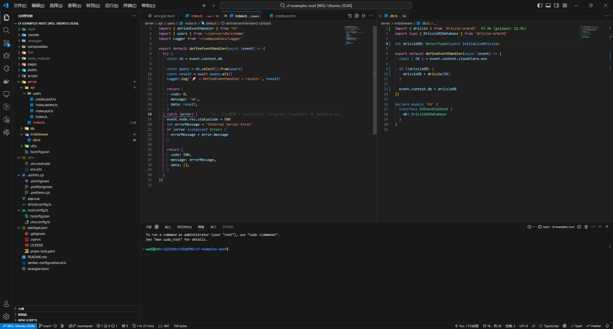

<samp><b>Di-got's VS Code Settings</b></samp>

[`.vscode/settings.json`](./.vscode/settings.json) 
[`.vscode/extensions.json`](./.vscode/extensions.json)

 
 

<samp>Preview</samp>

 

## LICENSE

<!-- ↓ Reference -->
<!-- https://github.com/antfu/vscode-settings.git -->

<!-- code --list-extensions | ForEach-Object {"code --install-extension $_"} > extensions.ps1 -->
<!-- echo '{"recommendations":['$(code --list-extensions | sed 's/^/"/;s/$/",/g')']}' > extensions.json -->
